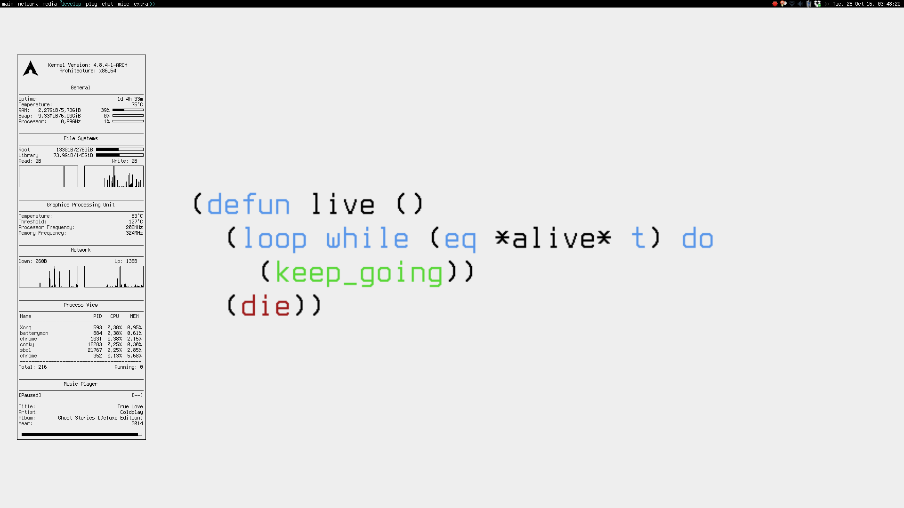

dotfiles by luksamuk
====================

Some dotfiles and important system files used on my computer.

- etc 
Stuff that should go on /etc/ folder.

- misc 
Miscellaneous stuff such as useful scripts.

- screenshots 
Screenshots for whenever I feel like changing everything.

- All others 
Stuff that should go on home folder.

Everything on this repository is distributed under the WTFPL License, unless the file provides its own license type.

Preview
-------

